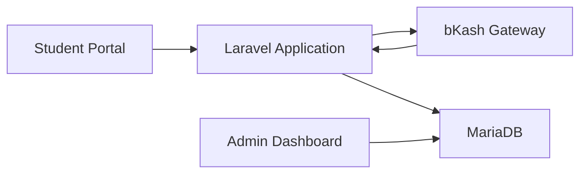

# Payment Collection Platform Architecture

## Overview

Payment Collection Platform is a centralized bill collection and payment processing system that enables students/customers to pay bills through bKash and other payment channels.

The platform handles:

- Bill generation
- Payment initiation
- Gateway communication
- Transaction verification
- Reconciliation
- Reporting

---

## Technology Stack

### Backend

- PHP 8.x
- Laravel Framework

### Database

- MariaDB

### Gateway Communication

- cURL
- REST APIs

### Infrastructure

- Apache / Nginx
- Linux Server

---

## High-Level Architecture

---

## Core Modules

### Student Billing Module

Responsible for:

- Bill generation
- Student lookup
- Due calculation

### Payment Processing Module

Responsible for:

- Payment initiation
- Transaction tracking
- Gateway communication

### Reconciliation Module

Responsible for:

- Success verification
- Duplicate prevention
- Daily reconciliation

### Reporting Module

Responsible for:

- Collection reports
- Monthly reports
- Settlement reports
